<h1 align="center">Hi, I'm Amin &nbsp;</h1>

  

  
  

## Languages & Tools

  
  
  
  

## Codewars

  

- **Rank:** 5 kyu
- **Honor:** 199
- **Top language:** Python
- **Member since:** September 2024

## Pinned Projects

| Project | What it does | Stack |
| --- | --- | --- |
| [**morpheus**](https://github.com/a-aghamohammadi/morpheus) | Generates a 3D conformer ensemble from a SMILES string using CONFORGE | Python |
| [**smartcyp-docker**](https://github.com/a-aghamohammadi/smartcyp-docker) | Containerised SMARTCyp 2.4 on a minimal Alpine JRE 8 runtime | Docker |
| [**free-wilson-analysis**](https://github.com/a-aghamohammadi/free-wilson-analysis) | Scaffold finding, R-group decomposition and Free-Wilson analysis for a congeneric series | Jupyter |

## GitHub Stats

  
  

